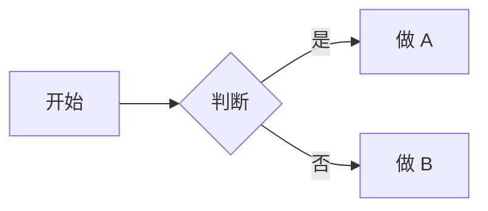
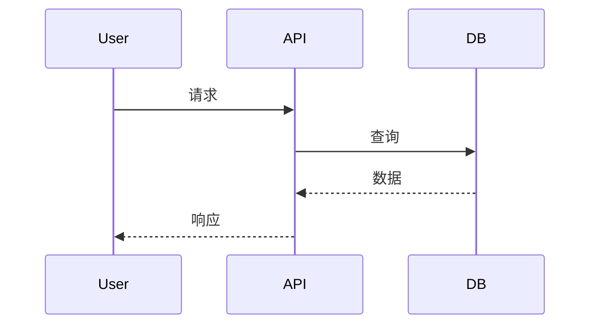

# 共享输出格式规范 (Shared Output Format)

> 本文件定义 AI 角色产出物的**通用格式规范**，确保所有文档风格一致、可读性高、易于维护。

---

## 📖 使用说明

所有 AI 角色在产出文档时，应遵循本文件的规范。这保证了：
- 不同角色产出的文档**风格一致**
- 长期维护时**降低认知负担**
- **方便自动化处理**（如文档巡检）

---

## 一、Markdown 格式规范

### 1.1 标题层级

使用标准的 Markdown 层级：
- `#` 文档主标题（每个文档只有一个）
- `##` 一级章节
- `###` 二级子章节
- `####` 三级（尽量避免，需要时使用）

**不要**跳级：`## → ####` 是错误的。

### 1.2 列表

**无序列表**: 使用 `-`（统一，不混用 `*`）

```markdown
- 项目 1
- 项目 2
  - 子项目
```

**有序列表**: 用 `1.` 开头，Markdown 会自动编号

```markdown
1. 第一步
2. 第二步
3. 第三步
```

### 1.3 代码块

**行内代码**: 用反引号包围
- 文件名: `CLAUDE.md`
- 变量名: `userId`
- 命令: `pnpm install`

**代码块**: 用三个反引号 + 语言标识

```typescript
// TypeScript 代码
const foo = 'bar';
```

```bash
# Shell 命令
pnpm install
```

### 1.4 表格

用 Markdown 表格，字段对齐：

```markdown
| 列 1 | 列 2 | 列 3 |
|------|------|------|
| 值 1 | 值 2 | 值 3 |
```

### 1.5 强调

- **粗体**: 重要概念、关键术语
- *斜体*: 强调、书名
- `代码`: 技术术语、变量、命令
- ~~删除线~~: 废弃内容（保留记录时用）

### 1.6 链接

**内部文档链接**（使用相对路径）:
```markdown
[项目宪法](../00-core/PROJECT_CONSTITUTION.md)
```

**外部链接**:
```markdown
[Next.js 官方文档](https://nextjs.org/docs)
```

### 1.7 引用块

用于 `>` 开头：
- **提醒/警告**: 重要提示
- **示例/引用**: 引用外部内容

```markdown
> 🎯 **核心提醒**: 重要的点用引用块强调
```

---

## 二、文档结构规范

### 2.1 标准文档头部

所有文档都应有标准头部：

```markdown
# [文档标题]

> [一句话说明本文档的用途和读者]

---

## 📌 元信息

| 字段 | 值 |
|------|-----|
| 项目代号 | `[代号]` |
| 文档版本 | `v1.0` |
| 创建日期 | `YYYY-MM-DD` |
| 最后更新 | `YYYY-MM-DD` |
| 创建者 | `R[X] + [用户]` |

---
```

### 2.2 标准文档尾部

所有文档都应有标准尾部：

```markdown
## 📝 变更日志

| 日期 | 变更 | 变更者 |
|------|------|--------|
| YYYY-MM-DD | 初版 | R[X] |
| | | |

---

## 📖 相关文档

- [`相关文档 1`](./path/to/doc1.md)
- [`相关文档 2`](./path/to/doc2.md)

---

> 🎯 **核心提醒**: 
> **[对读者的一句话叮嘱]**
```

### 2.3 章节分隔

主要章节之间用 `---` 分隔（水平线），增加视觉呼吸感。

---

## 三、内容写作规范

### 3.1 语气与人称

- **技术文档**: 客观、中立，避免过度使用"我"
- **指南文档**: 对读者（"你"）直接讲话，亲切
- **宪法/原则类**: 简洁有力，用陈述句

### 3.2 长度原则

- **单个段落**: 不超过 4-5 句话
- **单个章节**: 控制在 1-2 屏
- **文档整体**: 根据用途。参考文档可以长，操作指南越短越好

### 3.3 具体 vs 抽象

- ❌ "我们应该注重性能"（太抽象）
- ✅ "LCP 目标 < 2.5s，超过需要优化"（具体）

### 3.4 主动 vs 被动

优先使用主动语态：
- ❌ "数据应该被验证"
- ✅ "验证所有用户输入"

### 3.5 避免的表达

- ❌ "可能"、"也许"、"似乎"（模糊）
- ❌ "未来可以考虑"（悬而未决）
- ❌ "以后再说"（拖延）

**替代**:
- ✅ "当前不做，记录到 OPEN_QUESTIONS.md"
- ✅ "视情况而定，决策条件: [...]"

---

## 四、特殊元素规范

### 4.1 状态标记

统一的状态标记符号：

| 符号 | 含义 | 使用场景 |
|------|------|---------|
| ✅ | 完成 / 通过 | 任务完成、检查项通过 |
| ❌ | 未完成 / 禁止 | 未做的、禁止的 |
| ⚠️ | 警告 / 注意 | 需要特别留意 |
| 🔴 | 严重 / 必须 | 关键问题、硬性要求 |
| 🟡 | 一般 / 建议 | 次要问题、建议做 |
| 🟢 | 良好 / 可选 | 小问题、锦上添花 |
| 📌 | 重点信息 | 元信息、关键点 |
| 🎯 | 目标 / 提醒 | 核心提醒、目标 |
| 💡 | 提示 / 灵感 | 小贴士 |
| 🚨 | 严重警告 | 禁区、危险 |
| 📝 | 记录 / 日志 | 变更日志、记录 |

### 4.2 任务清单

用 Markdown 复选框：

```markdown
- [ ] 待办事项
- [x] 已完成事项
```

### 4.3 代码示例的"好 vs 坏"

用 ✅ 和 ❌ 标注：

```typescript
// ❌ 错误示例
db.query(`SELECT * FROM users WHERE id = '${id}'`);

// ✅ 正确示例
db.query('SELECT * FROM users WHERE id = ?', [id]);
```

### 4.4 日期格式

统一用 **ISO 8601**:
- 日期: `YYYY-MM-DD`（如 `2026-04-21`）
- 时间: `YYYY-MM-DD HH:MM`（如 `2026-04-21 14:30`）

不要用 `4/21/2026` 或 `21-4-2026`。

### 4.5 决策记录（ADR）格式

所有重要决策遵循 ADR 格式：

```markdown
### ADR-XXX: [决策标题]

- **日期**: YYYY-MM-DD
- **状态**: [提议 / 已接受 / 已废弃 / 已取代(-> ADR-YYY)]
- **决策者**: [...]

#### 背景
[问题描述]

#### 考虑的选项
1. **选项 A**: [描述 + 优劣]
2. **选项 B**: [...]
3. **选项 C**: [...]

#### 决策
**选择**: [选项 X]

#### 理由
1. [...]
2. [...]

#### 后果
- ✅ 好处: [...]
- ⚠️ 代价: [...]

#### 后续评估条件
[什么情况下重新评估]
```

### 4.6 用户故事格式

```markdown
### 📖 US-XXX: [简短标题]

**用户故事**:
> 作为 **[角色]**  
> 我希望 **[能力/操作]**  
> 以便 **[价值/目的]**

**验收标准**:
```

### 4.7 Given-When-Then 格式

用于验收标准：

```markdown
Given [前置条件]
When [用户操作]
Then [预期结果]
```

---

## 五、文件命名规范

### 5.1 命名约定

- **英文为主**: 文件名用英文
- **大写字母**: 重要文档全大写（`README.md`, `CLAUDE.md`）
- **snake_case**: 普通文档用下划线（或连字符）
- **日期前缀**: 如 `2026-04-21-postmortem.md`

### 5.2 保留文件名

以下是标准化的保留文件名，不要改：

- `README.md` - 项目说明
- `CLAUDE.md` - AI 上下文文件
- `CHANGELOG.md` - 变更日志
- `CONTRIBUTING.md` - 贡献指南
- `LICENSE` - 许可证
- `PROJECT_CONSTITUTION.md`
- `DECISIONS.md`
- `CONSTRAINTS.md`
- `GLOSSARY.md`
- 所有 `[STAGE]_[TYPE].md`（如 `VISION.md`, `REQUIREMENTS.md`）

### 5.3 FEAT 文件命名

```
FEAT-001-user-registration.md
FEAT-002-user-login.md
```

格式: `FEAT-[3位编号]-[kebab-case-标题].md`

### 5.4 ADR 文件命名（如单独文件存储）

```
ADR-001-use-nextjs.md
ADR-002-postgresql-over-mysql.md
```

---

## 六、交叉引用规范

### 6.1 引用其他文档

```markdown
详见 [`PROJECT_CONSTITUTION.md`](../00-core/PROJECT_CONSTITUTION.md) 第二章。
```

### 6.2 引用 ADR

```markdown
本决策记录在 ADR-010。
```

### 6.3 引用用户故事

```markdown
实现 US-001（用户注册）时，参考 FEAT-001 任务文档。
```

### 6.4 引用外部资源

```markdown
参考 [React 官方 Hooks 文档](https://react.dev/reference/react) 。
```

---

## 七、图表规范

### 7.1 使用 Mermaid

优先使用 Mermaid 图（可以文本形式版本控制）：

**流程图**:


**时序图**:


**ER 图**:


### 7.2 使用 ASCII 艺术（简单场景）

```
┌──────────┐     ┌──────────┐
│ Service A│ --> │ Service B│
└──────────┘     └──────────┘
```

### 7.3 避免外部图片

能用 Mermaid/ASCII 的，不用图片（图片难维护，容易过时）。

---

## 八、可维护性规范

### 8.1 每次变更必须

- 更新文档末尾的"变更日志"表
- 更新"最后更新"日期
- 如是重大变更，考虑是否需要 ADR

### 8.2 废弃内容处理

不要直接删除，而是：

```markdown
## ~~旧方案 (已废弃 2026-04-21)~~

> ⚠️ **已废弃**: 改用新方案 [...]  (见 ADR-XXX)

~~原有内容~~
```

或用引用块标注：

```markdown
> ⚠️ **本章节已废弃**: 见 ADR-XXX
```

### 8.3 TODO 和 FIXME

在文档中标记未完成的部分：

```markdown
<!-- TODO(R3): 补充性能基准数据 -->
<!-- FIXME(R5): 本节与 API_DESIGN.md 有冲突 -->
```

---

## 九、文档的"健康度"自检

写完一份文档后，自问：

- [ ] 有明确的读者？（谁会看这份文档？）
- [ ] 读者能在 10 分钟内理解？
- [ ] 有 3 个月后自己能看懂的清晰度？
- [ ] 每个"应该"都可以验证？
- [ ] 引用的其他文档链接有效？
- [ ] 变更日志已更新？
- [ ] 最后更新日期准确？

全部 ✅ 才算合格。

---

## 📝 变更日志

| 日期 | 变更 | 变更者 |
|------|------|--------|
| YYYY-MM-DD | 初版 | R8 |
| | | |

---

> 🎯 **核心提醒**: 
> **统一的格式让文档成为团队的第二语言**。
> **不统一的文档 = 每次阅读都要重新适应 = 认知负担。**
