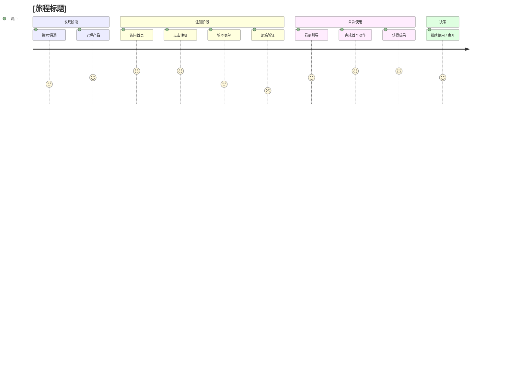

# 用户旅程图 (User Journeys)

> 本文件描绘关键场景下用户的完整使用流程，补充用户故事在"连贯性"上的不足。

---

## 📌 元信息

| 字段 | 值 |
|------|-----|
| 项目代号 | `[项目代号]` |
| 文档版本 | `v1.0` |
| 创建日期 | `YYYY-MM-DD` |
| 旅程总数 | `[X] 个` |

---

## 一、旅程 vs 用户故事

### 区别

**用户故事 (User Story)**: 一个独立的功能单元（树叶）  
**用户旅程 (User Journey)**: 用户完成某个目标的完整路径（整棵树）

### 为什么两者都需要？

- 用户故事告诉工程师"**要实现什么**"
- 用户旅程告诉产品"**如何连贯地交付价值**"
- 没有旅程视角，容易做出"每个功能都对，整体体验烂"的产品

---

## 二、旅程索引

| ID | 旅程名称 | 主要角色 | 覆盖故事 | 重要级别 |
|----|---------|---------|---------|---------|
| J-001 | [如"新用户完成首次使用"] | 新用户 | US-001, US-002, US-005 | ⭐⭐⭐ |
| J-002 | [如"日常使用核心功能"] | 老用户 | US-005, US-006 | ⭐⭐⭐ |
| J-003 | [如"邀请协作"] | 普通用户 | US-010, US-011 | ⭐⭐ |
| ... | | | | |

---

## 三、旅程详情

---

## 🗺️ J-001: [旅程名称]

### 基本信息

| 字段 | 值 |
|------|-----|
| **旅程 ID** | J-001 |
| **覆盖场景** | [VISION.md 中的场景编号或名称] |
| **主要角色** | [新用户 / 老用户 / ...] |
| **关键级别** | ⭐⭐⭐ (核心) |

### 场景背景

**什么情况下发生**:
```
[用户在什么状态下、什么触发、要达到什么目的]
```

**用户目标**:
```
[用户从这次旅程中期望获得什么]
```

**旅程开始前的用户状态**:
- [情绪：...]
- [已知信息：...]
- [期望：...]

**旅程结束后的理想状态**:
- [情绪：...]
- [完成：...]
- [进入下一步：...]

### 旅程全景图



### 详细步骤

#### Step 1: [步骤名称]

| 字段 | 内容 |
|------|------|
| **用户动作** | [用户做了什么] |
| **系统响应** | [系统做了什么] |
| **涉及功能** | US-001, US-002 |
| **页面/界面** | [在哪个页面] |
| **用户情绪** | 😊 兴奋 / 😐 中立 / 😟 困惑 / 😢 沮丧 |
| **停留时间** | [预计] |
| **潜在流失点** | [如果有，说明为什么用户会在此放弃] |
| **优化机会** | [如何让这一步更顺滑] |

**详细过程**:
```
1. 用户 [...]
2. 系统 [...]
3. 用户看到 [...]
```

#### Step 2: [步骤名称]
[同上]

#### Step 3: [...]

#### Step 4: [...]

#### Step 5: [...]

### 关键触点 (Moments of Truth)

> 用户决定继续还是放弃的关键时刻。这些是优化的重点。

#### 🎯 触点 1: [标题]
- **发生位置**: Step [X]
- **为什么关键**: [...]
- **用户可能产生的疑问**: [...]
- **如何打消疑虑**: [...]
- **成功信号**: [用户继续的标志]
- **失败信号**: [用户放弃的标志]

#### 🎯 触点 2: [...]

### 潜在痛点与解决方案

| 痛点 | 发生于 | 影响 | 解决方案 |
|------|-------|------|---------|
| [痛点 1] | Step X | [...] | [...] |
| [痛点 2] | Step Y | [...] | [...] |

### 成功标志

**旅程完成的标志**:
- [具体的用户行为或状态]

**旅程的北极星指标**:
- [衡量此旅程成功的关键指标]

**转化漏斗** (如适用):
```
100% 访问者
  ↓ [X%] 流失
80% 点击注册
  ↓ [Y%] 流失
60% 完成注册
  ↓ [Z%] 流失
40% 完成首次使用
```

### 与其他旅程的关系

- **上游**: [从哪个旅程过来？]
- **下游**: [可能进入哪些旅程？]
- **并行**: [有哪些可能同时发生的旅程？]

---

## 🗺️ J-002: [...]

[同上结构]

---

## 🗺️ J-003: [...]

[同上结构]

---

## 四、跨旅程分析

### 常见流失点

把所有旅程中的流失点汇总，识别**产品级的痛点**：

| 流失点 | 出现于 | 影响范围 | 优先级 |
|-------|-------|---------|--------|
| [痛点 1] | J-001, J-002 | [...] | 高 |

### 常见成功模式

把各旅程中的"成功触点"汇总：

- [模式 1]: 在 [...] 时，[...] 能显著提升转化
- [模式 2]: [...]

---

## 五、情绪地图

### 理想情绪曲线

```
高 5 ┤        ╭──╮       ╭────────
     │       ╱    ╲      ╱
 4 ┤──╮   ╱      ╲    ╱
     │   ╲ ╱        ╲  ╱
 3 ┤    V          ╲╱
     │
 2 ┤
     │
 1 ┤
    └──────────────────────────→
    Step1  Step2  Step3  Step4  Step5
```

### 关键原则

1. **首次接触应高分**: 给用户良好的第一印象
2. **避免连续低分**: 连续 2 步低分 = 高概率流失
3. **关键节点必须高分**: 完成核心动作时应有成就感
4. **低点要有解释**: 如果某步必然让用户感到"麻烦"（如验证邮箱），要让用户理解为什么值得

---

## 六、旅程测试清单

### 在 Stage 6 质量保障阶段，对每个旅程：

- [ ] 有 E2E 测试覆盖完整路径
- [ ] 每个关键触点有专项测试
- [ ] 所有"潜在流失点"都有应对方案
- [ ] 情绪曲线符合预期（通过用户测试验证）

---

## 七、旅程演进记录

### 为什么记录？

产品迭代会让旅程改变。这个章节记录重大变更，便于追溯。

### 变更记录

#### YYYY-MM-DD: [变更标题]
- **变更前**: [旅程的样子]
- **变更后**: [新旅程的样子]
- **原因**: [...]
- **影响**: [用户 / 数据指标]

---

## 📝 变更日志

| 日期 | 变更 | 变更者 |
|------|------|--------|
| YYYY-MM-DD | 初版 | R2 |
| | | |

---

## 📖 相关文档

- [`REQUIREMENTS.md`](./REQUIREMENTS.md) - 需求总览
- [`USER_STORIES.md`](./USER_STORIES.md) - 具体用户故事
- [`../02-vision/VISION.md`](../02-vision/VISION.md) - 产品愿景中的场景
- [`../07-quality/TEST_STRATEGY.md`](../07-quality/TEST_STRATEGY.md) - 旅程对应的测试策略

---

> 🎯 **核心提醒**: 
> **功能正确 ≠ 体验好**。
> **用户旅程让我们从"做对每个功能"进化到"交付连贯的价值"。**
