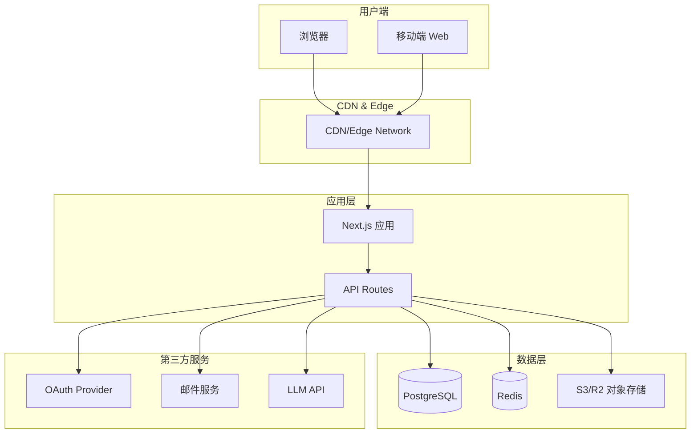
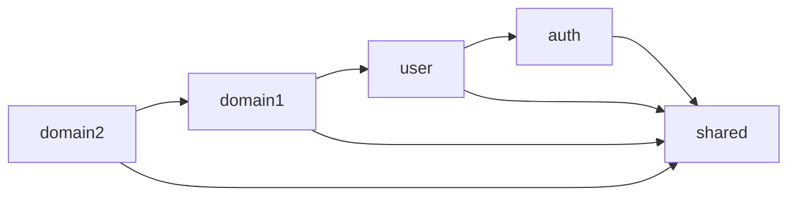
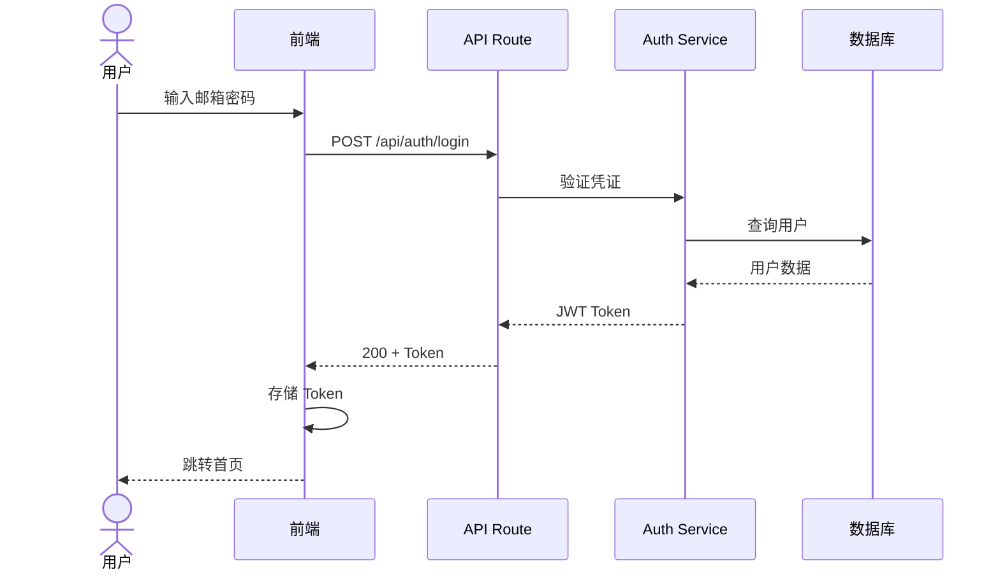
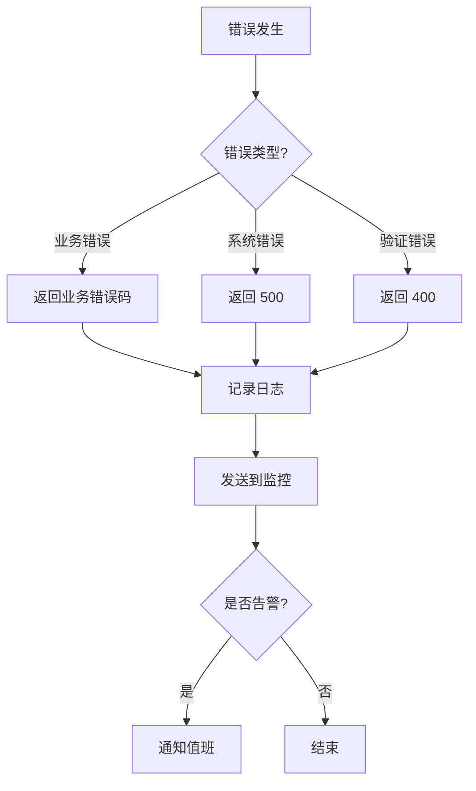

# 系统架构设计 (System Architecture)

> 本文件是 R3 架构师的核心产出之一。描绘整个系统的技术架构全景。

---

## 📌 元信息

| 字段 | 值 |
|------|-----|
| 项目代号 | `[项目代号]` |
| 文档版本 | `v1.0` |
| 创建日期 | `YYYY-MM-DD` |
| 最后更新 | `YYYY-MM-DD` |
| 架构师 | `R3 + [你]` |

---

## 一、架构概览 (Architecture Overview)

### 1.1 一句话概括

```
[用一句话说清楚：这是一个什么样的系统]

例：一个基于 Next.js 的全栈 Web 应用，采用模块化单体架构，
前后端同构，通过 PostgreSQL 持久化数据，部署在 Vercel。
```

### 1.2 系统总图



### 1.3 架构模式选择

**采用模式**: `[单体 / 模块化单体 / 微服务 / Serverless]`

**选择理由** (详见 DECISIONS.md ADR-XXX):
1. [理由 1]
2. [理由 2]
3. [理由 3]

**考虑过但未选择的模式**:
- **[模式 A]**: 放弃理由 - [...]
- **[模式 B]**: 放弃理由 - [...]

---

## 二、架构驱动因素 (Architecture Drivers)

### 2.1 质量属性目标

| 属性 | 目标值 | 优先级 | 实现策略 |
|------|-------|--------|---------|
| 性能 | LCP < 2.5s, API P95 < 500ms | 高 | SSR + CDN + 缓存 |
| 可用性 | 99.9% | 中 | 多实例 + 故障转移 |
| 安全性 | 无高危漏洞 | 高 | 纵深防御 |
| 可扩展性 | 支持 10x 增长 | 中 | 无状态设计 + 水平扩展 |
| 可维护性 | 新功能 < 1 周/个 | 高 | 清晰分层 + 高测试覆盖 |
| 成本 | 月成本 < $X | 高 | Serverless + 按量计费 |

### 2.2 关键约束

引用 `CONSTRAINTS.md`：
- 技术栈约束
- 禁用技术
- 性能预算
- 成本预算

### 2.3 架构关键用例

> 最能暴露架构压力的场景，必须在架构设计中考虑周全。

| 用例 | 挑战 | 架构应对 |
|------|------|---------|
| [高频操作 - 如首页加载] | 响应速度 | SSG + CDN |
| [复杂业务 - 如 AI 生成] | 长耗时、资源密集 | 异步队列 + 任务状态 |
| [敏感操作 - 如支付] | 安全性、事务一致性 | 幂等 + 双写 + 审计 |

---

## 三、分层架构 (Layered Architecture)

### 3.1 分层示意

```
┌───────────────────────────────────────┐
│  Presentation Layer                    │
│  (UI 组件 + 页面 + API 路由)           │
├───────────────────────────────────────┤
│  Application Layer                     │
│  (用例编排 + 应用服务)                 │
├───────────────────────────────────────┤
│  Domain Layer                          │
│  (业务逻辑 + 领域模型 + 领域服务)      │
├───────────────────────────────────────┤
│  Infrastructure Layer                  │
│  (数据库 + 缓存 + 外部服务集成)        │
└───────────────────────────────────────┘
```

### 3.2 层职责定义

#### Presentation Layer (展示层)
**职责**:
- 用户交互 (UI 组件、页面)
- HTTP 请求处理 (API 路由)
- 输入验证
- 响应格式化

**不做**:
- ❌ 不包含业务逻辑
- ❌ 不直接访问数据库

#### Application Layer (应用层)
**职责**:
- 编排领域服务完成用例
- 事务管理
- 跨领域的协调

**不做**:
- ❌ 不包含领域规则（那是 Domain 的职责）
- ❌ 不关心 UI 细节

#### Domain Layer (领域层)
**职责**:
- 业务实体和值对象
- 领域规则和约束
- 领域服务 (业务不变量)

**不做**:
- ❌ 不依赖任何基础设施
- ❌ 不依赖任何框架

#### Infrastructure Layer (基础设施层)
**职责**:
- 数据持久化实现
- 外部服务调用
- 技术性工具（日志、缓存、消息队列）

### 3.3 依赖方向规则

```
Presentation  →  Application  →  Domain
       ↓              ↓
   Infrastructure ←——————————————
```

**核心原则**: 依赖倒置
- 业务层定义接口，基础设施层实现
- 业务层**不依赖**基础设施层的具体实现
- 更换数据库、切换 API 不应影响业务逻辑

---

## 四、模块划分 (Module Structure)

### 4.1 模块列表

| 模块名 | 职责 | 对外暴露 | 隐藏细节 |
|--------|------|---------|---------|
| `auth` | 认证鉴权 | login/logout/verify API | 密码哈希实现 |
| `user` | 用户管理 | User 实体 + CRUD | 数据库细节 |
| `[domain1]` | [核心业务域] | [...] | [...] |
| `[domain2]` | [...] | [...] | [...] |
| `shared` | 跨模块共享 | 通用工具、类型 | - |

### 4.2 模块依赖图



**规则**:
- `shared` 不依赖任何业务模块
- 禁止循环依赖
- 业务模块之间最多单向依赖

### 4.3 模块边界规则

**模块对外通信**:
- ✅ 通过模块的 `index.ts` 暴露的 public API
- ❌ 禁止跨模块访问内部文件

**模块内部结构** (每个模块遵循相同结构):
```
modules/[moduleName]/
├── components/      ← UI 组件
├── hooks/           ← 自定义 Hooks
├── services/        ← 业务服务
├── repositories/    ← 数据访问
├── types/           ← 类型定义
├── utils/           ← 模块内工具
├── tests/           ← 测试
└── index.ts         ← 对外 API
```

---

## 五、关键技术决策 (Key Decisions)

> 详细决策记录见 `DECISIONS.md`。此处列出架构级别的核心决策摘要。

### 5.1 核心决策速查

| 决策点 | 选择 | ADR | 替代方案 |
|-------|------|-----|---------|
| 架构模式 | 模块化单体 | ADR-010 | 微服务、Serverless |
| 前端框架 | Next.js 14 | ADR-011 | Remix, SvelteKit |
| 数据库 | PostgreSQL | ADR-012 | MySQL, MongoDB |
| ORM | Prisma | ADR-013 | Drizzle, TypeORM |
| 认证 | NextAuth | ADR-014 | 自建, Auth0 |
| 部署 | Vercel | ADR-015 | Railway, 自建 |

---

## 六、关键流程设计 (Key Flows)

### 6.1 认证流程



### 6.2 [核心业务流程]

[绘制最重要的业务流程时序图]

### 6.3 错误处理流程



---

## 七、非功能设计

### 7.1 性能设计

**前端性能策略**:
- Next.js SSG / ISR 用于静态内容
- SSR 用于动态内容
- 路由级 + 组件级代码分割
- 图片 next/image 自动优化
- 关键 CSS 内联

**后端性能策略**:
- 数据库连接池
- 关键查询缓存 (Redis)
- N+1 查询检测
- 分页必选（禁止全量加载）
- 异步任务队列

### 7.2 可扩展性设计

**无状态设计**:
- 应用实例不持有状态
- Session 存储在 Redis
- 文件存储在对象存储

**水平扩展**:
- Serverless 自动扩容
- 或基于指标的水平伸缩

### 7.3 可靠性设计

**冗余**:
- 多区域部署（如需要）
- 数据库主从

**容错**:
- 第三方调用重试 + 熔断
- 超时控制
- 降级方案

**恢复**:
- 数据每日备份
- 灾难恢复演练

### 7.4 安全设计概览

> 详见 `SECURITY_DESIGN.md`。

**纵深防御**:
1. 边缘层: WAF, DDoS 防护 (CDN)
2. 应用层: 认证、授权、输入验证
3. 数据层: 加密存储、访问审计
4. 监控层: 异常检测、告警

---

## 八、部署架构 (Deployment Architecture)

### 8.1 环境划分

| 环境 | 用途 | URL 模式 | 数据 |
|------|------|---------|------|
| Local | 本地开发 | localhost | 本地 DB |
| Preview | PR 预览 | pr-xxx.vercel.app | 隔离 DB |
| Staging | 预发测试 | staging.xxx.com | 生产数据复制 |
| Production | 生产 | xxx.com | 生产 DB |

### 8.2 部署拓扑

```
[Vercel Edge Network]
         ↓
[Vercel Serverless Functions]
         ↓
[Supabase PostgreSQL] --- [Upstash Redis]
         ↓
[Cloudflare R2 对象存储]
```

---

## 九、可观测性设计

### 9.1 日志

- 格式: 结构化 JSON
- 分级: debug / info / warn / error
- 聚合: [Vercel Logs / Datadog / 自建]
- 保留: 30 天

### 9.2 监控

- APM: [Sentry / Datadog]
- 指标: Prometheus 风格
- 告警: 关键指标异常时通知

### 9.3 追踪

- 分布式追踪: OpenTelemetry
- Request ID 贯穿全链路

---

## 十、架构演进路径 (Evolution)

### 10.1 短期（3-6 个月）

- [当前架构够用，重点在业务迭代]

### 10.2 中期（6-12 个月）

**可能的演进方向**:
- 若 QPS > [X]: 拆分读写库
- 若模块耦合重: 考虑拆分独立服务
- 若某模块计算密集: 抽离为 Worker

### 10.3 长期（1-2 年）

- [根据业务发展重新评估]

### 10.4 演进原则

- ✅ 可逆的决策快做
- ✅ 不可逆的决策慢做
- ✅ 只在出现真实压力时演进
- ❌ 不为"未来可能的"需求预先设计

---

## 📝 变更日志

| 日期 | 变更 | 变更者 |
|------|------|--------|
| YYYY-MM-DD | 初版 | R3 |
| | | |

---

## 📖 相关文档

- [`TECH_STACK.md`](./TECH_STACK.md) - 技术栈详情
- [`DATABASE.md`](./DATABASE.md) - 数据库设计
- [`API_DESIGN.md`](./API_DESIGN.md) - API 规范
- [`DIRECTORY_STRUCTURE.md`](./DIRECTORY_STRUCTURE.md) - 目录结构
- [`SECURITY_DESIGN.md`](./SECURITY_DESIGN.md) - 安全设计
- [`../00-core/DECISIONS.md`](../00-core/DECISIONS.md) - 决策记录

---

> 🎯 **核心提醒**: 
> **好架构是写给未来的自己和团队的情书。**
> **当三个月后你回来看这份文档时，应该能立刻"恢复记忆"——为什么当初这么设计。**
