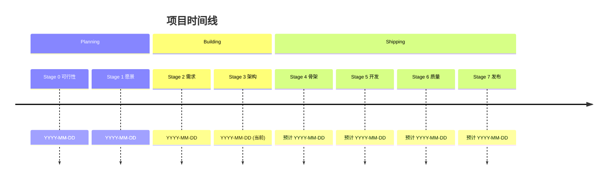

# 工作流状态 (Workflow State)

> 本文件是项目当前状态的"仪表盘"。R8 项目协调官持续维护。
> 查看此文件可以快速了解：项目在哪个阶段、进展如何、下一步做什么。

---

## 📌 元信息

| 字段 | 值 |
|------|-----|
| 项目代号 | `[项目代号]` |
| 创建日期 | `YYYY-MM-DD` |
| 最后更新 | `YYYY-MM-DD HH:MM` |

---

## 一、当前状态 (Snapshot)

### 🎯 当前阶段

**Stage [X]: [阶段名]**

当前活跃角色: `R[X]`  
预计本阶段完成: `YYYY-MM-DD`

### 🏥 整体健康度

- **进度**: 🟢 按计划 / 🟡 略有延迟 / 🔴 严重落后
- **质量**: 🟢 良好 / 🟡 有瑕疵 / 🔴 有严重问题
- **风险**: 🟢 低 / 🟡 中 / 🔴 高
- **士气**: 🟢 高 / 🟡 中 / 🔴 低

### 📊 关键数字

- 项目已运行: [X] 天
- 预计总时长: [X] 天
- 已完成功能: [X] / [Y]
- 待解决问题: [X] 个
- 技术债: [X] 项

---

## 二、阶段进度

### 已完成

- [x] **Stage 0 - 可行性验证** (完成于 YYYY-MM-DD)
  - 结论: [Go / Conditional Go]
  - R8 审查: ✅ 通过
  
- [x] **Stage 1 - 构想打磨** (完成于 YYYY-MM-DD)
  - 产出: VISION.md
  - R8 审查: ✅ 通过

- [x] **Stage 2 - 需求规格化** (完成于 YYYY-MM-DD)
  - 产出: REQUIREMENTS.md, USER_STORIES.md, USER_JOURNEYS.md
  - 故事总数: [X] 个 (P0: X, P1: Y)
  - R8 审查: ✅ 通过

### 进行中

- [ ] **Stage [X] - [阶段名]** (开始于 YYYY-MM-DD)
  - 进度: [X%]
  - 当前状态: [描述]
  - 预计完成: YYYY-MM-DD

### 待开始

- [ ] Stage [X+1] - [阶段名]
- [ ] Stage [X+2] - [阶段名]
- [ ] ...

---

## 三、最近的重要事件

### YYYY-MM-DD - [事件标题]
[事件描述和影响]

### YYYY-MM-DD - [事件标题]
[...]

> 💡 更完整的事件记录见 `logs/DAILY_LOG.md`

---

## 四、最近的审查

### 上次 R8 审查
- **日期**: YYYY-MM-DD
- **类型**: [阶段门禁 / 周度巡检]
- **结论**: [...]
- **行动项**: 
  - [x] [已完成]
  - [ ] [待做]

### 上次 R10 文档巡检
- **日期**: YYYY-MM-DD
- **发现**: [X] 严重问题、[Y] 一般问题
- **修复**: [进度]

### 上次 R11 风险扫描
- **日期**: YYYY-MM-DD
- **类型**: [全景 / 定向]
- **发现**: [X] 关键风险
- **应对**: [进度]

---

## 五、当前关注点

### 🎯 本周重点

1. [重点 1]
2. [重点 2]
3. [重点 3]

### ⚠️ 需要关注的风险

1. [风险]: [状态]
2. [...]

### 🚧 当前阻塞

- [ ] [阻塞项]: 等待 [...]

---

## 六、下一步规划

### 近期（未来 1 周）

- [ ] [计划事项 1]
- [ ] [计划事项 2]
- [ ] [计划事项 3]

### 中期（未来 1 月）

- [...]

### 关键里程碑

| 里程碑 | 目标日期 | 状态 |
|--------|---------|------|
| MVP 完成 | YYYY-MM-DD | 🟢 按计划 |
| 公开发布 | YYYY-MM-DD | 🟡 可能延迟 |

---

## 七、资源状态

### 时间投入

- 本周投入: [X] 小时
- 累计投入: [X] 小时
- 预计总投入: [X] 小时

### 成本状态

- 本月支出: $[X]
- 累计支出: $[X]
- 预算剩余: $[X]

---

## 八、待办事项汇总

### 关键待办

- [ ] [待办 1] - 负责人: [...]
- [ ] [待办 2] - 负责人: [...]

> 完整待办见 `OPEN_QUESTIONS.md`

---

## 九、项目里程碑时间线

---

## 📝 更新日志

| 日期 | 更新者 | 主要变更 |
|------|-------|---------|
| YYYY-MM-DD | R8 | 初版 |
| YYYY-MM-DD | R8 | Stage 1 完成，进入 Stage 2 |
| | | |

---

> 🎯 **核心提醒**: 
> **这是"一眼看懂项目"的入口。**
> **保持更新频率（至少每周一次），这份文件的价值就高。**
